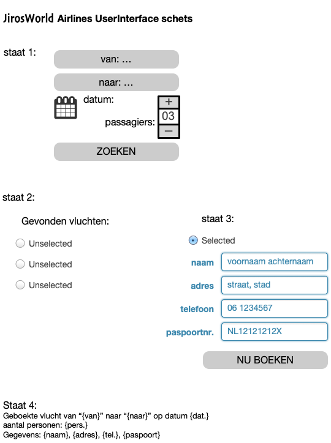

# Sharevalue assessment

Gebouwd: een applicatie om een vlucht te boeken: een gebruiker kan een vertrek en een aankomstlocatie invoeren, de gewenste vertrekdatum en het aantal personen. Na het klikken op de zoekknop krijg je een overzicht met gevonden vluchten. Als de gebruiker een vlucht selecteert kan de gebruiker zijn gegevens invoeren en krijgt de gebruiker een overzicht van de gegevens.

De focus ligt op de flight search, de data is gemockt (JSON). De bedragen/datums die bij de vluchten te zien zijn, zijn niet echt en er zijn maar een beperkt aantal bestemmingen.

De opdracht is in het front-end framework React gemaakt.

De look & feel is eenvoudig gehouden, maar wel met 1 styled-component.

De opdracht is in te zien op 3 manieren:

1. Link naar de demo: https://main--sharevalue-airlines-jiro.netlify.app/ (via Netlify.) of via https://sharevalue-airlines-jiro.netlify.app/
2. Link naar de repo: https://github.com/JirosWorld/sharevalue-airlines (zodat code kan worden beoordeeld, en jullie zelf de applicatie kunnen draaien om te kijken hoe het werkt).
3. Maak gebruik van minimaal één zoekvoorbeeld waarmee gezocht kan worden in de applicatie: ```Zoek bijvoorbeeld op 'Berlin' en 'New York'```

Handleiding van de interface:


### Techniek:

- denkstappen in [pseudocode hier](PSEUDOCODE.md).
- React versie 18
- React hooks
- useState
- useEffect
- useRef
- CSS (niet responsive, alleen voor desktop)

## Geïnstalleerd maar niet gebruikt

- React Hook-Form extension (dus de formulieren zijn geheel uitgeschreven, in useState)
- Axios extension voor Fetch

### Experimentele branches:

- https://feature-filtersearch--sharevalue-airlines-jiro.netlify.app/
- https://open-flight-api--sharevalue-airlines-jiro.netlify.app/

### UI schets:

